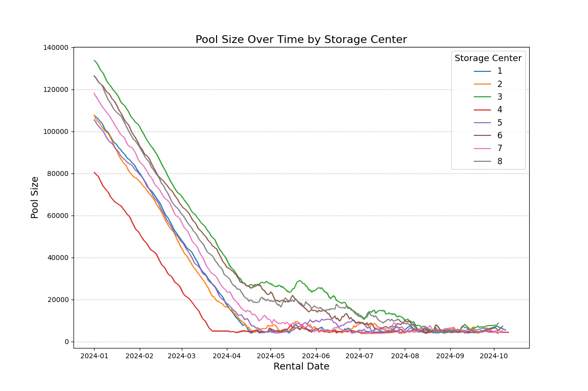
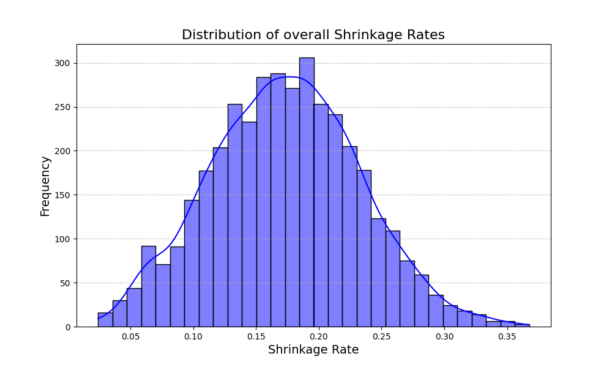

# David Sanchez Matarredona

## Run instructions
 - Use a Python 3.6 environment (or higher)
 - To install dependencies run: pip install -r requirements.txt
 - Execute: python main.py

## Model assumptions
  - All parameter values can be setted in conf.yaml
  - The data is generated for a "days_number" period from "starting_date"
  - There is "sc_quantity" storage centers with RPC capacity of "sc_size_avg" average
  - RPCs are sent in batches of "rpc_batch_avg_size" average size. Every day each sc sends 1 to "max_batches_per_day" until reaching its "target_sc_rpc_pool_size" when no more batches are sent until some RPCs return to the minimun pool
  - RPCs travel along "rpc_trip_avg_days_duration" average days after wich are returned to the sc pool having into account the lost boxes
  - The shrinkage rate is different for each batch. There is a sc specific schrinkage component and a batch speific component

## Results
  - The experiment plots the RPC pool size evolution for each sc along time (into the figures folder)
  - The experiment plots the overall shrinkage rate distribution and sc shrinkage rate distribution (into the figures folder)
  - Shrinkage rate can be stimated as the prefered centrality measure of such distribution (overall and per sc). Some sc have worse rate (since we included a sc specific effect in our model)
  - Pool size and shrincage rate are related since pool is reduced at the shrinkage rate. The effect is visible after 100 days once the first RPCs start to return
  - If we could only measure the rental date of a percentage of trips we wouldn't be able to know when some RPCs are leaving. We could be still getting some useful data as long as we were able to measure when a RPCs with known rental date is returned or lost. In such case shrinkage rate can be stimated with a smaller sample size but pool size can only be stimated relatively to the tracked RPCs. We could only be able to monitor pool size if we know, at least, the percentaje of tracked RPCs and extrapolate their shrinkage rate to the untracked RPCs

  

  

